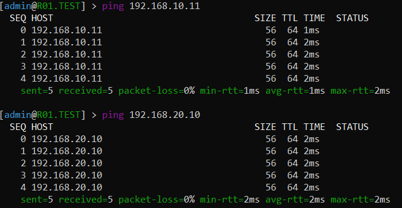
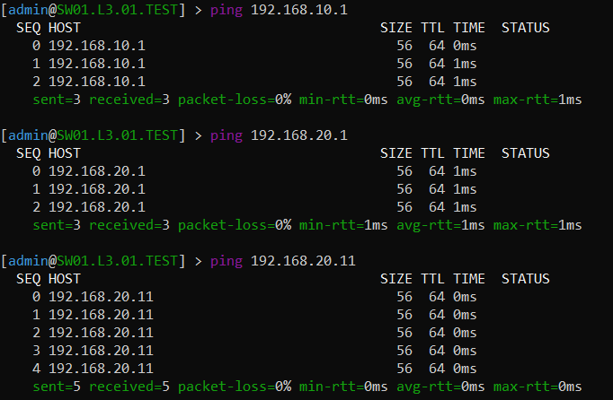
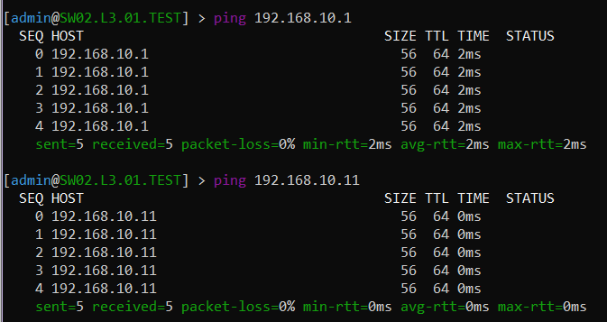

####University: [ITMO University](https://##3itmo.ru/ru/)

####Faculty: [FICT](https://fict.itmo.ru)

####Course: [Introduction in routing](https://github.com/itmo-ict-faculty/introduction-in-routing)

####Year: 2022/2023

####Group: K33212

####Author: Spevak Elena Aleksandrovna

####Lab: Lab1

####Date of create: 20.09.2022

####Date of finished: 20.10.2022

#**Отчёт по лабораторной работе №1**

В ходе работы был создан файл task1.yaml, в котором описана вся топология трехуровневой сети связи классического предприятии


С помощью ContainerLab были созданы все устройства и соединения между ними.
Была создана сеть lspevak_mgmt, настроены  IP адреса на интерфейсах и два VLAN-a для двух компьютеров, созданы два DHCP сервера на центральном роутере во VLAN-ах для расдачи IP адресов на комьютеры. 

Настройка устройств:
- Роутер R01.TEST:
```/interface vlan
add interface=ether2 name=vlan10 vlan-id=10
add interface=ether2 name=vlan20 vlan-id=20
/interface wireless security-profiles
set [ find default=yes ] supplicant-identity=MikroTik
/ip pool
add name=pool20 ranges=192.168.20.10-192.168.20.254
add name=pool10 ranges=192.168.10.10-192.168.10.254
/ip dhcp-server
add address-pool=pool20 disabled=no interface=vlan20 name=dhcp20
add address-pool=pool10 disabled=no interface=vlan10 name=dhcp10
/ip address
add address=172.31.255.30/30 interface=ether1 network=172.31.255.28
add address=192.168.10.1/24 interface=vlan10 network=192.168.10.0
add address=192.168.20.1/24 interface=vlan20 network=192.168.20.0
/ip dhcp-client
add disabled=no interface=ether1
add disabled=no interface=vlan10
add disabled=no interface=vlan20
/ip dhcp-server network
add address=102.168.10.0/24 gateway=192.168.10.1
add address=102.168.20.0/24 gateway=192.168.20.1
/system identity
set name=R01.TEST
```

На центальном роутере был настроен DHCP сервер, который выдает IP адреса компьютерам во VLAN-ах. Были выданы следующие адреса:

```[admin@R01.TEST] > ip dhcp-server lease print
Flags: X - disabled, R - radius, D - dynamic, B - blocked
 #   ADDRESS               MAC-ADDRESS       HOS... SERVER    RAT... STATUS  LAST-SEEN
 0 D 192.168.20.11         52:54:00:97:48:01 SW0... dhcp20           bound   6s
 1 D 192.168.20.10         52:54:00:F3:A1:01 SW0... dhcp20           bound   4m48s
 2 D 192.168.10.11         52:54:00:C6:89:01 SW0... dhcp10           bound   36s
```

- Коммутатор первого уровня SW01.L3.TEST:
```
/interface bridge
add name=bridge10
add name=bridge20
/interface vlan
add interface=ether2 name=vlan10 vlan-id=10
add interface=ether3 name=vlan10/ vlan-id=10
add interface=ether2 name=vlan20 vlan-id=20
add interface=ether4 name=vlan20/ vlan-id=20
/interface wireless security-profiles
set [ find default=yes ] supplicant-identity=MikroTik
/ip dhcp-server
add disabled=no interface=bridge10 name=dhcp1
/interface bridge port
add bridge=bridge10 interface=vlan10
add bridge=bridge20 interface=vlan20
add bridge=bridge10 interface=vlan10/
add bridge=bridge20 interface=vlan20/
/ip address
add address=172.31.255.30/30 interface=ether1 network=172.31.255.28
add address=192.168.10.2/24 interface=bridge10 network=192.168.10.0
add address=192.168.20.2/24 interface=bridge20 network=192.168.20.0
/ip dhcp-client
add disabled=no interface=ether1
add disabled=no interface=bridge20
/system identity
set name=SW01.L3.01.TEST
```

- Коммутатор второго уровня SW01.L3.01.TEST:
```/interface bridge
add name=bridge10
/interface vlan
add interface=ether2 name=vlan10 vlan-id=10
/interface wireless security-profiles
set [ find default=yes ] supplicant-identity=MikroTik
/interface bridge port
add bridge=bridge10 interface=vlan10
add bridge=bridge10 interface=ether3
/ip address
add address=172.31.255.30/30 interface=ether1 network=172.31.255.28
/ip dhcp-client
add disabled=no interface=ether1
add disabled=no interface=bridge10
/system identity
set name=SW02.L3.01.TEST
```

- Коммутатор второго уровня SW02.L3.02.TEST:
```/interface bridge
add name=bridge20
/interface vlan
add interface=ether2 name=vlan20 vlan-id=20
/interface wireless security-profiles
set [ find default=yes ] supplicant-identity=MikroTik
/interface bridge port
add bridge=bridge20 interface=vlan20
add bridge=bridge20 interface=ether3
/ip address
add address=172.31.255.30/30 interface=ether1 network=172.31.255.28
/ip dhcp-client
add disabled=no interface=ether1
add disabled=no interface=bridge20
/system identity
set name=SW02.L3.02.TEST
```

Проверка доступности компьютеров в локальных сетях(ping):







