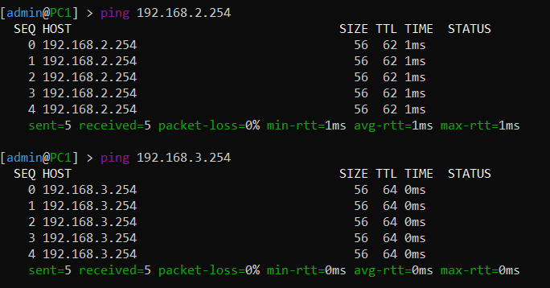
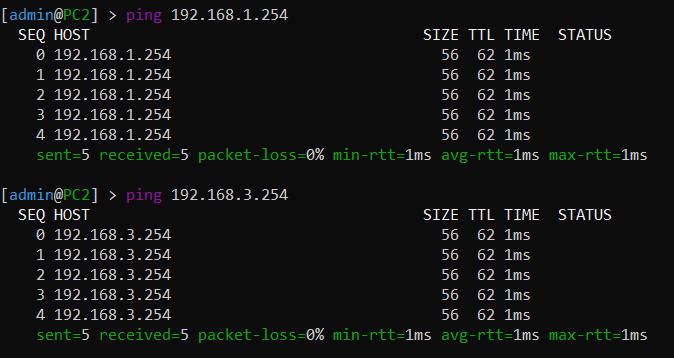
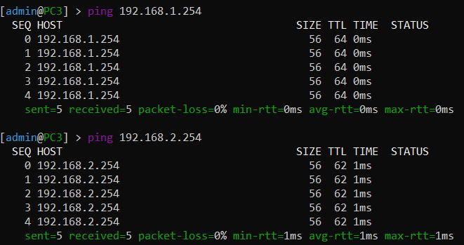

#### University: [ITMO University](https://##3itmo.ru/ru/)
#### Faculty: [FICT](https://fict.itmo.ru)
#### Course: [Introduction in routing](https://github.com/itmo-ict-faculty/introduction-in-routing)
#### Year: 2022/2023
#### Group: K33212
#### Author: Spevak Elena Aleksandrovna
#### Lab: Lab2
#### Date of create: 17.11.2022
#### Date of finished: 18.11.2022

# **Отчёт по лабораторной работе №2**

# Эмуляция распределенной корпоративной сети связи, настройка статической маршрутизации между филиалами

**Цель работы**

Ознакомиться с принципами планирования IP адресов, настройке статической маршрутизации и сетевыми функциями устройств.

В ходе работы была сделана сеть связи в трёх распределенных офисах "RogaIKopita Games" в ContainerLab. Топология сети описана в [yaml-файле](https://github.com/LenaSpevak/2022_2023-introduction_in_routing-k33212-spevak-e-a/blob/main/lab2/lab2.yaml). 

 
На всех устройсвтах были настроены IP адреса и статическая маршрутизация. На роутерах в сторону клиентских устройств были созданы DHCP серверы. 

Тексты конфигураций каждого из сетевых устройств:
- Роутер R01.BRL:
```/interface wireless security-profiles
set [ find default=yes ] supplicant-identity=MikroTik
/ip pool
add name=pool1 ranges=192.168.1.10-192.168.1.254
/ip dhcp-server
add address-pool=pool1 disabled=no interface=ether4 name=dhcp1
/ip address
add address=172.31.255.30/30 interface=ether1 network=172.31.255.28
add address=10.1.0.1/30 interface=ether2 network=10.1.0.0
add address=10.1.1.1/30 interface=ether3 network=10.1.1.0
add address=192.168.1.1/24 interface=ether4 network=192.168.1.0
/ip dhcp-client
add disabled=no interface=ether1
/ip route
add distance=1 dst-address=192.168.2.0/24 gateway=10.1.1.2
add distance=1 dst-address=192.168.3.0/24 gateway=10.1.0.2
/system identity
set name=R01.BRL
```
- Роутер R01.FRT:
```/interface wireless security-profiles
set [ find default=yes ] supplicant-identity=MikroTik
/ip pool
add name=pool2 ranges=192.168.2.10-192.168.2.254
/ip dhcp-server
add address-pool=pool2 disabled=no interface=ether4 name=dhcp2
/ip address
add address=172.31.255.30/30 interface=ether1 network=172.31.255.28
add address=10.1.1.2/30 interface=ether2 network=10.1.1.0
add address=10.1.2.2/30 interface=ether3 network=10.1.2.0
add address=192.168.2.1/24 interface=ether4 network=192.168.2.0
/ip dhcp-client
add disabled=no interface=ether1
/ip route
add distance=1 dst-address=192.168.1.0/24 gateway=10.1.1.1
add distance=1 dst-address=192.168.3.0/24 gateway=10.1.2.1
/system identity
set name=R01.FRT
```
- Роутер R01.MSK:
```/interface wireless security-profiles
set [ find default=yes ] supplicant-identity=MikroTik
/ip pool
add name=pool3 ranges=192.168.3.10-192.168.3.254
/ip dhcp-server
add address-pool=pool3 disabled=no interface=ether4 name=dhcp3
/ip address
add address=172.31.255.30/30 interface=ether1 network=172.31.255.28
add address=10.1.0.2/30 interface=ether2 network=10.1.0.0
add address=10.1.2.1/30 interface=ether3 network=10.1.2.0
add address=192.168.3.1/24 interface=ether4 network=192.168.3.0
/ip dhcp-client
add disabled=no interface=ether1
/ip route
add distance=1 dst-address=192.168.1.0/24 gateway=10.1.1.1
add distance=1 dst-address=192.168.2.0/24 gateway=10.1.2.2
/system identity
set name=R01.MSK
```
- PC1:
```/interface wireless security-profiles
set [ find default=yes ] supplicant-identity=MikroTik
/ip address
add address=172.31.255.30/30 interface=ether1 network=172.31.255.28
/ip dhcp-client
add disabled=no interface=ether1
add disabled=no interface=ether2
/ip route
add distance=1 dst-address=10.1.0.0/30 gateway=192.168.3.1
add distance=1 dst-address=10.1.2.0/30 gateway=192.168.3.1
add distance=1 dst-address=192.168.1.0/24 gateway=192.168.3.1
add distance=1 dst-address=192.168.2.0/24 gateway=192.168.3.1
/system identity
set name=PC1
```
- PC2:
```/interface wireless security-profiles
set [ find default=yes ] supplicant-identity=MikroTik
/ip address
add address=172.31.255.30/30 interface=ether1 network=172.31.255.28
/ip dhcp-client
add disabled=no interface=ether1
add disabled=no interface=ether2
/ip route
add distance=1 dst-address=10.1.1.0/30 gateway=192.168.2.1
add distance=1 dst-address=10.1.2.0/30 gateway=192.168.2.1
add distance=1 dst-address=192.168.1.0/24 gateway=192.168.2.1
add distance=1 dst-address=192.168.3.0/24 gateway=192.168.2.1
/system identity
set name=PC2
```
- PC3:
```/interface wireless security-profiles
set [ find default=yes ] supplicant-identity=MikroTik
/ip address
add address=172.31.255.30/30 interface=ether1 network=172.31.255.28
/ip dhcp-client
add disabled=no interface=ether1
add disabled=no interface=ether2
/ip route
add distance=1 dst-address=10.1.0.0/30 gateway=192.168.1.1
add distance=1 dst-address=10.1.1.0/30 gateway=192.168.1.1
add distance=1 dst-address=192.168.2.0/24 gateway=192.168.1.1
add distance=1 dst-address=192.168.3.0/24 gateway=192.168.1.1
/system identity
set name=PC3
```
Для проверки провреки локальной связанности были пропингованы все компьютеры:

Ping на PC1



Ping на PC2



Ping на PC3


